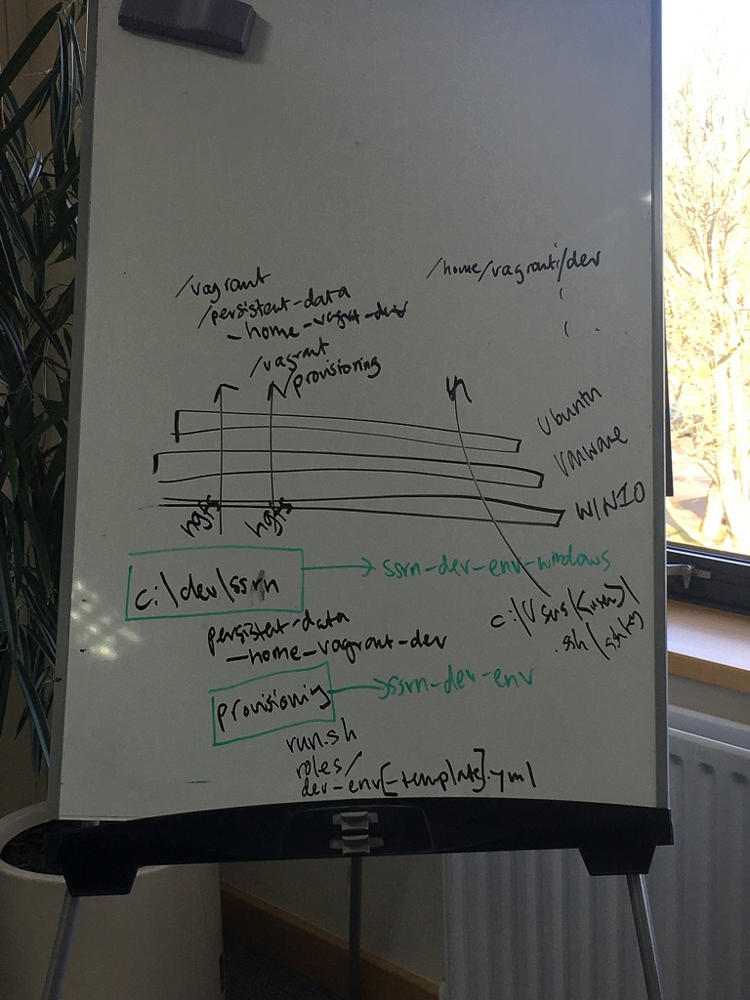
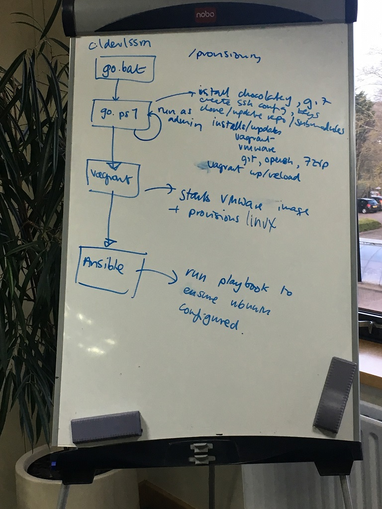
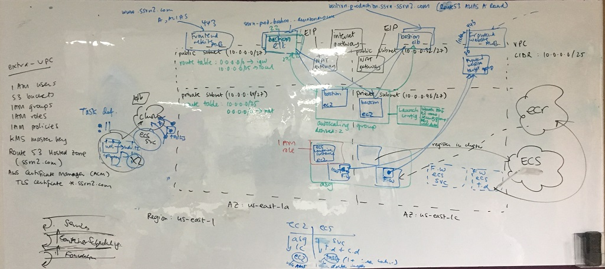
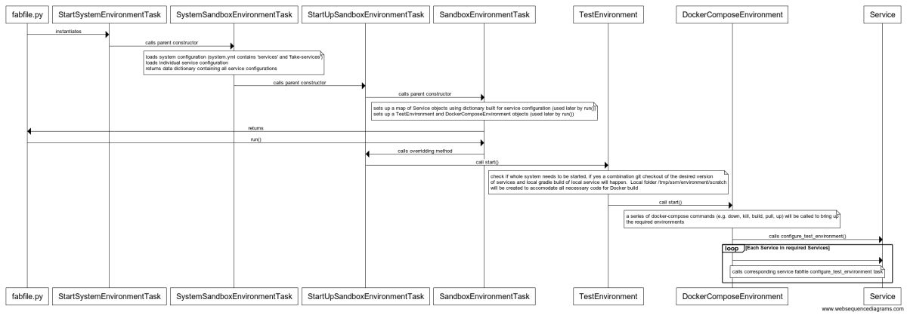

# SSRN Beta Search platform - Frequently Asked Questions

This document aims to provide a navegable route to understanding the technical estate involved in the microservices platform for Beta Search in the form of a FAQ.

## Local Development Environment

### What is the stack we use to do Linux-based development under Windows?

To do Linux development under windows we have Ubuntu installed on a VMWare Workstation virtual machin eimage and this software runs on Windows 10.



### What are the three repos associated with our local development environment?

* __[ssrn-development-environment-windows-vagrant-box](https://gitlab.et-scm.com/ssrn/ssrn-development-environment-windows-vagrant-box)__ is used for building new VMWare images.
* __[ssrn-development-environment-windows](https://gitlab.et-scm.com/ssrn/ssrn-development-environment-windows)__ contains the files used to start the VM in Windows, including the go.bat, go.ps1 scripts and the Vagrantfile.
* __[ssrn-development-environment](https://gitlab.et-scm.com/ssrn/ssrn-development-environment)__ is used for provisioning the virtual machine once booted into Linux, and includes scripts in Ansible.  This is mounted as a subproject in Git into the _provisioning_ directory of the __ssrn-development-environment-windows__ repository.

### What software is used to provision our local development environment?

1.  A simple DOS file (_go.bat_) chain loads...
2.  A PowerShell file (_go.ps1_) that does most of the initial work, such as ..
  - Installing the Windows Chocolatey package manager, then
  - Using Chocolatety to install/update tools such as Git and Ssh based on the configuration in _packages.config_
  - Configures Ssh
  - Ensures the Vagrant VMWare Plugin and licences are up to date
3.  Vagrant runs and this uses the Vagrant file to provision the box
4.  Vagrant runs the _provisioning/run.sh_ script, which then runs 
5.  Ansible, which provisions the software in the box.



### Why do we not use the default VMWare hgfs filesystem for mounting shares from the host?

There are a number of issues with using the inbuilt __hgfs__ filesystem for mounting the shares:

1. Everything gets mounted with the executable bit set in Linux.
1. Differences with the way Windows and Linux handle CRLF cause problems.

### How are the file systems mounted?

There are three files on the host file system that are mounted into the VM in the _/vagrant_ directory.

| File | Mounted in | Loopback device | Final destination |
| --- | --- | --- |---|
| -home-vagrant-dev | /vagrant/persistent-data/ | loop0 | /home/vagrant/dev
| -home-vagrant-.config-git | /vagrant/persistent-data/ | loop1 | /home/vagrant/.config/git
| -home-vagrant-.aws | /vagrant/persistent-data/ | loop2 | /home/vagrant/.aws

#### How do I see which filesystems are mounted?

Here are some handy commands: losetup and lsblk.

### Why is __vagrant ssh__ not working for me when working from home?

It won't work with the VPN running.  Disconnect the VPN and try again.

### Which Ssh key ends up on my virtual machine?

The private key _ssrn_development_ and public key _ssrn_development.pub_ located in the _.ssh_ directory of your Windows user home dir (%HOME) are copied into _/home/vagrant/.ssh_ by Vagrant.  The file _%HOME\.ssh\config_SSRN_ determines which keys to use to connect to SSRN.

### How are our virtual machines for development built?

We have a Git repo dedicated to building our default VMWare images; this repo is called [ssrn-development-environment-windows-vagrant-box](https://gitlab.et-scm.com/ssrn/ssrn-development-environment-windows-vagrant-box).

The starting point for building a box is the file __build.ps1__, which takes a base Ubuntu image, customises it, and then uploads it to a file share on the Elsevier internal network.  The script also updates __metadata.json__ with the path of the new image, and this is file used in the Vagrantfile of the ssrn-development-environment-windows repo when bringing up the vmware box.  For example:

  ```
  config.vm.box_url = "file:////ELSOXFDATP034/Apps/SSRN/Development/DevelopmentEnvironment/VagrantBox/metadata.json"
  ```

To build a new box, you need to run the file _build.bat_, but before doing this you need to manually mount and update the [dependent repository](https://gitlab.et-scm.com/ssrn/ssrn-development-environment) as a submodule:

  ```
  > git submodule update --init --remote
  > go.bat
  ```

#### Where do we get the base Ubuntu images from?

Our base images come from Chef, in the form of their Packer templates for building minimal Vagrant base boxes distributed through their [Bento project](http://chef.github.io/bento/).  The advantage of using these is that they contain not only the base Ubuntu distribution but also come with the VMWare Tools package already installed.  See

### How to back-up my IntelliJ licence file?

Run the following command from within Ubuntu (replacing _YYYY.V_ with the version, for example _2017.3_):

```
cp ~/.IntelliJIdeaYYYY.V/config/idea.key /vagrant/provisioning/roles/intellij_idea_workstation/files/config/
```

---

## Fabric scripts

### When I do _fab build_ it says I don't have permissions to pull docker images from Amazon ECR, what am I doing wrong?

You need to use the _developer_ AWS_ACCESS_KEY_ID and AWS_SECRET_ACCESS_KEY credentials, which are stored in the Keepass.  You can store these in _~/.aws/credentials_ for easy access.

### How do I run the tests in non-headeless mode?

Set:
 - BROWSER_BASED_TESTING_VISIBLE = true 
 - BROWSER_BASED_TESTING_SCREENSHOT_DIRECTORY_PATH = ./screenshots
    
---

## Gradle Custom Configuration

When developing with Java, we use [Gradle](https://gradle.org/) to do the following:
- Define intra-project dependencies and dependencies on third party libraries 
- Retrieve third party libraries from repositories on the internet
- Compile source code
- Run tests
- Assemble JARs
- Define IDEA modules

### Gradle Customisation
We have customised the our Gradle configuration as set out below. Common customisations have been placed in the `system/build.gradle` root gradle file and applied to all/some subprojects based on certain criteria. To acheive this, we have used the following gradle functionality:
- `subprojects` iterates through all child projects
- `afterEvaluate` used when we want a subproject's configuration to be evaluated by Gradle before we reason about it or manipulate it
- `evaluationDependsOnChildren()` used to force child projects to be evaluated before any [service root](#custom-service-root-concept) project, because the service root project configuration depends on the state of its children

#### IntelliJ IDEA-compatible build directory
Rationale: so we can restart services when they are recompiled from either Gradle or IDEA
- It would be nicer to not couple Gradle to IDEA but unfortunately, we cannot override the IDEA build directory (i.e. change `/out` to `/build`) in a way that will maintain separate subdirectories for each source set (e.g. `integration-tests`).
- The IDEA scheme includes a subdirectory for each source set which uses the source set's name, except for the `main` source set, which IDEA chooses to call `production`. We have therefore implemented this logic in Gradle too.
- We also configure the `main` and `test` source sets upfront since they are always present 
- We have used the `whenObjectAdded` method to dynamically update a custom source set's build directory when the source set is added to a project. This was required because waiting until after the project was evaluated (using `afterEvaluate`) leads to a given project's output path having different values in differnt parts of the final configuration.
  
#### Verbose test output
Rationale: so we can understand what's happening
- Log when tests start, pass, fail or are skipped
- Log exceptions and full stack traces
   
#### Never skip test runs
Rationale: so we always run them
- By default, Gradle only runs a task if it is not considered 'up to date'. For test tasks, `update to date` means the resulting test report files have newer timestamps than the test code source files. We prefer to _always_ run tests when they are part of a Gradle task graph. Therefore, we have overridden the `upToDateWhen` logic for all tests tasks, to never be up to date.
    
#### Maintain source file timestamps when building JARs
Rationale: to maintain JAR file checksums, to avoid invalidating Docker caches
- When gradle builds a JAR, its contents are copied with new timestamps. This affects the checksum of the resulting JAR. When the JAR checksum changes, it invalidates the associated cached docker image layer, leading to costly downloads of many megabytes from our docker image repository.  

#### Custom `classpath` and `runtimeLibraries` tasks
Rationale: to dump compile code, resources and libraries into build directory, for inclusion in Docker container
- Avoids need to build a fat JAR per service, thus enabling fast reloads of services when source code changes
- For fast reload of service when libraries have been added/removed/changed, run `gradle runtimeLibraries`. Also required when shared project code is changed, since it is treated as a library (JAR) by consuming service.
- Implementation detail: we always delete the target directory before copying libraries, to ensure libraries we no longer rely on are removed
  
#### Copy external and internal dependencies to different output subdirectories so they can be treated as separate Docker image layers.
  - Avoids invalidating cached Docker image layer of third part libraries (which is large) whenever internal library is changed
  - Hacky implementation based on fact that external dependencies will be stored under a `.gradle` directory
  
#### <a name="service-root"></a>Custom _Service Root_ concept
Rationale: used to perform further customization required on service roots only
- For the root project of any service, e.g. `system/services/authors/build.gradle`
- Relies on specifiying `serviceRoot = true` extra property on service's root `build.gradle` file

#### Custom `projectExists` task in [service root](#custom-service-root-concept) projects
Rationale: used by Fabric automation code to check whether a given project directory contains a gradle project requiring compilation

#### Custom `unitTest` task in [service root](#custom-service-root-concept) projects
Rationale: for running all unit test tasks found in any of the service's gradle projects
- These tasks are identified simply by the fact that their name is `test`, rather than, say, `integrationTest`

#### Custom `environmentTest` task in [service root](#custom-service-root-concept) projects
Rationale: for running all non-unit test tasks found in any of the service's gradle projects.
- These tasks are identified simply by the fact that their name is not `test`, for example `integrationTest`
- These tests are assumed to require a running environment, hence the name.
 
#### Custom `interServiceContractTest` task in [service root](#custom-service-root-concept) projects
Rationale: for running all inter-service contract tests found in any of the service's gradle projects.
- These tests are identified by the fact that they have a `interServiceContractTest` extra property set to `true`.
- They take a `contractTestRealService` property which, when set to `true`, tells test to skip injecting data into a fake (e.g. Fake Papers Service) and instead expect real Papers Service to be running.

#### Custom HTML test reports for all unit tests, environment tests and inter-service contract tests, respectively, under a given [service root](#custom-service-root-concept).
Rationale: to make it easy to consume test results in CI
- Generated after running tests, whether they succeed or not.
- Displayed in CI builds, e.g. see "Unit-Test" tab of any commit pipeline's "run" stage "run" job.
 
#### Multiple test source sets per project
Rationale: We have a need to isolate different test classpaths for a single service (e.g. Papers) or component (e.g. Replicator), so we can run specific groups of tests in isolation (e.g. just integration tests) and manage their dependencies independently.
- We could have separated created gradle subprojects for each distinct set of tests but this leads to a proliferation of gradle project files to manage, dependencies are harder to manage and artifacts are harder to reason about.
- We chose to have a separate source set for each distinct set of tests instead. Implementing this requires the following:
  - Define new sourceset in a gradle project file's `sourceSets` block, specifying the java source and resources directory paths (note, we chose kebab-case, e.g. 'service-test' rather than the default 'serviceTest'). Optionally, setting the `compileClasspath` and `runtimeClasspath` to include another source set's compiled output (e.g. the `integrationTest` source set's classpath includes the `main` source set's classes) 
  - Optionally define a new configuration in the gradle project file's `configurations` block, this is useful when the source set has the same dependencies as an existing source set (e.g. `integrationTestCompile` extends from the `main` source set's `compile` configuration)
  - Define dependencies for the custom source set in the gradle project file's `dependencies` block, within a custom configuration, e.g. `integrationTestCompile`
  - Define a new task, with `type: Test`, to run the tests from the custom source set, defining where the test classes are located (`testClassesDir`) and the classpath that should be used at runtime (`classpath`). Optionally, specify `shouldRunAfter` to ensure the test task only runs after faster, more low level tests have run
   
#### Custom `compileCss` task in Frontend Website gradle project
Rationale: SASS needs to be compiled to CSS and added to the static assets in the `resources` output subdirectory for the Frontend Website component
- The `classes` task of the Frontend Website gradle project depends on the `compileCss` task so it gets run automatically as part of the build
- The custom task has type `Exec`, meaning it can run an arbitrary executable with arbitrary arguments
- The task can be used to watch for changes in SASS classes and automatically recompile to CSS. Simply run `gradle -Pwatch=true compileCss` from the Frontend Website directory. Note: there is a Fabric task as well, called `watch_assets`. The recompiled CSS files are mounted into the running docker container so there's no need to restart the service. Therefore, you should ensure you have turned off the file watcher for restarting the whole docker container.
- Within the Frontend Website gradle project file, we have made use of gradles `idea` plugin to tell IDEA that it should treat `src/main/scss` as a directory of source files. IDEA will take note of this as part of generating its modules when importing the gradle files.

#### Contract Test Fat JARs using `shadow` plugin
Rationale: We need to distribute our contract tests to other development teams in a single, self-contained artifact
- The `shadow` plugin adds a `shadowJar` task which we configure as folows:
  - Use the compiled files from our `oldPlatformContractTest` custom source set
  - Include the runtime dependencies from our `oldPlatformContractTest` custom source set
  - Instruct the plugin to merge any [service files](https://docs.oracle.com/javase/7/docs/technotes/guides/jar/jar.html#Service_Provider) in the third-party runtime libraries
  - Make the JAR 'executable' by specifying a default entrypoint main class
  - Simplify the name of the JAR
    
### Importing Gradle into IDEA
Since we import our gradle configuration into IDEA, IDEA keeps its modules in-sync with our gradle multi-project configuration.
- It relies on the `system/settings.gradle` file to determine which projects exist 
- IDEA's auto-import feature updates each IDEA module's dependencies we change them in Gradle
- We have told IDEA to create an IDEA module per gradle source-set, rather than per gradle project. This is a good thing because:
  - Isolate source set dependencies into separate IDEA modules
  - Separate IDEA module for each test suite (e.g. `integration-tests`)

## Security

#### How do we do SSH key rotation?

---

## GoCD

We use ThoughtWorks' Go Continuous Delivery software to manage our deployment pipeline.  There are two installations:

* [Pipeline](https://pipeline.ssrn2.com) - used for deployment of our core services
* [Pipeline Controller](https://pipeline-controller.ssrn2.com) - used for deployment of Pipeline

#### How does the authentication integration between GoCD and GitLab work?

We use the [GitLab OAuth authorization plugin for GoCD](https://github.com/gocd-contrib/gitlab-oauth-authorization-plugin) to authenticate using our Enterprise GitLab accounts.
The account names are normally the same as our Windows ActiveDirectory login usernames.

The plugin is provisioned using the to the server using the _ensure gitlab oauth authorization go server plugin installed_ task of the [automation_server Ansible playbook](https://gitlab.et-scm.com/ssrn/ssrn/blob/master/global/ansible-roles/automation_server/tasks/main.yml).

Usernames that are authorised to login are stored in the _/etc/go/users_ file on the GoCD server. __Note: a user name must be listed in this file in order for them to be able to login.__  This file is managed by Terraform files for the Pipeline and Pipeline Controller, for example, for Pipeline the variable is called _automation_server_users_.  Users need also to be enabled in GoCD and made Admins in order to use GoCD.

#### How do I change the users that are authorised to login?

The steps are:
1. Change the Terraform configuration and deploy the new _/etc/go/users_ file*
2. Via the GoCD user interface under __Admin->User Summary__ disable any users who should no longer be able to login.  Note: it's not possible to completely remove them using the UI!
3. Via the UI Add the user in question and give them the Go System Administrator role.

\* Note you can login to the box and manually edit the _/etc/go/users_ file and then do steps 2 and 3, but do make sure you also add the users to Terraform.

#### How is the configuration for GoCD backed-up and how do I trigger it manually?

The Bash script _/usr/local/bin/backup_go.sh_ is run from root's crontab every hour.  Make sure you run this manually before redeploying the GoCD server.

---

## System Infrastructure in AWS

We use AWS to manage our cloud infrastructure. This is managed/deployed using infrastructure-as-code tooling, specifically Terraform scripts (More info:https://www.terraform.io/)



### Which region do we host our infrastrure in?
US East (N. Virginia) region

### What is the CIDR range for our VPC? How do we change them, if needed?

We use a range of 10.0.0.0/25, which is 126 ipaddesses. Ideally we should use Elsevier's own reserved ranges. To change the current CIDR range we will have to manually destroy our VPC and redeploy.
We have an exclusive VPC deployment pipeline on our GOCD server.

### Which availability zones do our EC2's get deployed to?

We need m5.large EC2 instances, these are not available in the us-east-1b availibility zone currently. We therefore deploy our ECS cluster across us-east-1a and us-east-1c.

### Why do we use ELB's and not ALB's for bastion/jumpboxes?

Elastic/Classic Load balancers operate at TCP level which enables us to SSH into the bastion for monitoring our EC2 cluster boxes.
Application Load balancers, however are HTTPS aware and allow dynamic port assignment for our docker instances.

### The ecs_container_instance launch configuration has an attribute key_name, what is it?

This is the initial/default SSH key which was generated locally and is stored in our SSRN keypass file.
Note: When we create our QA cloud environment, we will need to recreate a new one.

### Bastion / Jumpboxes

Bastions are machines which allow us to get ssh access to our internal AWS infrastructure.

#### Bastion machines
- bastion.production.ssrn.ssrn2.com
- bastion.qa.ssrn.ssrn2.com
- bastion.production.ssrn_pipeline.ssrn2.com
- bastion.production.ssrn_pipeline_controller.ssrn2.com

The current list can be in [Route 53](https://console.aws.amazon.com/route53/home?region=us-east-1#resource-record-sets:Z1R69FCK7LDKF8)

#### ssh to a bastion machine (-A passes the ssh keys on to further ssh connections)
```
ssh -A ubuntu@bastion.production.ssrn.ssrn2.com
```

*When running the command in the development vm ensure the ubuntu user is specified - so the correct ssh keys are used
i.e. ssh -A ubuntu@bastion.production.ssrn.ssrn2.com*

*You may see "ECDSA host key for bastion.production.ssrn.ssrn2.com has changed and you have requested strict checking.
Host key verification failed."
This is because we have multiple instances of the bastion machines, these are accessed via the same DNS name via a load balancer. The work around is to run the command again until you reach the same machine you have used in the past.*

#### To Access Machines beyond the bastion machine
Obtain the ssrn_production_default ssh key (SSRN production default SSH key) from the ssrn password-vault

- Save this in ~/.ssh
- Set the correct permissions:
  - $ chmod 0600 ~/.ssh/ssrn_production_default
- Generate a public key from the private key:
  - $ ssh-keygen -y -f ~/.ssh/ssrn_production_default > ~/.ssh/ssrn_production_default.pub
  
#### To Access Docker intsances

- identify the EC2 host the docker image in running on
    - find the docker in Amazon ECS
    - click *Tasks*
    - click on one of the task instances (this is the runnking docker instance)
    - click on *Container instance*
    - record the *Private IP*
- ssh to the EC2 instance using the *Private IP*
- identify the docker instance
 ```
sudo docker ps
 ```
- logon to the docker instance
```
sudo docker exec -it <container id> bash 
```

#### How are the bastion boxes provisioned?

These are provisioned using a userdata script which installs ansible and uses the bastion_ansible_playbook.yml.tpl and bastion_ansible_requirements.yml.tpl
for provisioning the bastion instances.

### How do I ensure that a new ASG will get deployed?

To ensure that a new Auto-scaling-group gets deployed with our latest changes, we use a name_prefix instead of name in the launch_configuration.
Once the launch configuration gets deployed its name gets updated which then kicks of a new updated deployment of auto-scaling-group.

### Why is there a GO deployment agent in our VPC?

We use flyway for our database migration scripts, this GO deployment agent enables us to run the migration scripts on the RDS in a secure private zone.

### How do I ensure my custom environment variables are set for any service I deploy?

In the aws_ecs_task_definition terraform script, we use json template file to ensure any enviroment variables that are configured are set when the service is deployed.

### Why does the ecs_service load balancer listen on port 8080?

That is because our services use dropwizard, whose default port is 8080.

### Ansible

#### What are the Ansible User Data scripts used when deploying EC2 instances in AWS?

The user data [template file is located in our repo](https://gitlab.et-scm.com/ssrn/ssrn/blob/master/system/container-scheduling-layer/services-cluster/infrastructure/modules/user_data_template/files/user_data.sh.tpl).

### How do developer public ssh keys get onto EC2 instances?

Each developer's ssh key is installed on each EC2 instance to allow us to log in to the boxes and control who can and cannot get access.

We have default keys for QA and Production stored in our team KeypassX file just in case.

To get a key onto the boxen one first uploads the ssh public key to their IAM user account.

The IAM user needs to be a member of the __ssrn.%ENVIRONMENT%.ssh_users__ group.

When provisioning the box, the Ansible __aws_ssh_server__ role runs the script _update_authorized_ssh_keys.sh_, which connects to AWS and downloads all the relevant ssh public keys that it needs.

The same Ansible role also sets up cron to run the synchronisation script every 3 minutes in order to ensure the keys are up to date.

#### What do we do when someone leaves?

Remove the user from __both__ the __ssrn.qa.ssh_users__ and __ssrn.production.ssh_users__ groups.

(Also we should remove their ssh keys from the IAM user and disable their IAM account)

#### What do we do when someone joins?

1. They need to generate or install their keys on their machine (Windows host).   The private key should be called _ssrn_development_ and the public key _ssrn_development.pub_.
1. Get them to upload their public ssh key to their IAM account.  __Make sure that their ssh key has been protected by a decently long passphrase__.
1. Ensure that they are in __both__ the __ssrn.qa.ssh_users__ and __ssrn.production.ssh_users__ groups.
2. Wait for three minutes and get them to login. 

---

### Logging / Kibana

Kibana is what we use for capturing log files and graphing them.  This works by an architecture comprising of three parts:

1. Kibana runs on top of Elastic Search (using the logging-index cluster).
1. Logstash runs in the [Logging Service](https://gitlab.et-scm.com/ssrn/ssrn/tree/master/system/services/logging) and puts things into Kibana.
    1. the entire system logs are stored in the logstash index
    1. the frontend access logs are stored in the frontend-accesslog index (kept for 1 year for GDPR)
1. Filebeat runs on each Docker service and passes logs to Logstash.
1. [logging-janitor](https://gitlab.et-scm.com/ssrn/ssrn/tree/master/system/services/logging/infrastructure/logging-janitor/logging-janitor.py) cleans up old logs. It runs as a [AWS Lambda](https://console.aws.amazon.com/cloudwatch/home?region=us-east-1#rules:name=ssrn-production-logging-logging-janitor-trigger)  
 
#### How do we backup, restore and control the Kibana configuration?

We store the [Kibana configuration in our SSRN git repo](https://gitlab.et-scm.com/ssrn/ssrn/blob/master/system/services/logging/kibana-configuration.json).

If you make changes to the Kibana configuration that you want to save, export a new version of the configuration by going to the __Management__ menu, then __Saved Objects__, then the __Export Everything__ option.

To import a configuration go to the __Management__ menu, then __Saved Objects__, then the __Import__ option.

### What does our QA Environment entail?

#### General GO CD related

Every pipeline change must pass through "deploy-to-qa" stage before "deploy-to-production", and the pipeline 'ansible-role-factory' publishes the common fabfile which is used by all ansible role commit pipeline for pushing ansible role changes to S3.

In GO CD, #{} refers to GO CD Parameters variables and ${} refers to GO CD environment variables

New GO CD agents for QA have been defined in 'qa_deployment_agent.tf'. GO CD server hands out auto generated key (see 'tokenGenerationKey' in config.xml) for all agents to use as part of their identification process to the server in addition to the public certificate key and public IP whitelisting from NAT gateway for security purpose.    

#### Impact on all deploy-to-production pipelines

Any deploy-to-production pipeline will have a parameter 'deployment_package_pipeline' referencing the commit phase via the deploy-to-qa phase in the format of (e.g. vpc-commit/vpc-deploy-to-qa), this will ensure the same artifact built for QA deployment is used by Production deployment.

#### On VPC and Scheduling Services Cluster level

In GO CD, vpc-commit now takes various ansible versions as dependencies(see Materials tab), and the 'build_arguments_string' from Parameters tab provides all the ansible versions required which is used by the build task of fabfile.py file.

In fabfile-deployment.py, there are a number of placeholders which will be replaced by the "envsubst" command in fabfile.py:build when creating deployment.tgz

Same applies to Scheduling Services Cluster pipelines 
  
#### Logging service related

Kibana link for QA logging https://search-qa-logging-index-khidjxhwqvcq542hhadqlynpnq.us-east-1.es.amazonaws.com/_plugin/kibana/app/kibana#/discover?_g=()

### Search service related

Search uses new S3 remote state to look up environment specific names for kinesis and Elasticsearch

#### Managed services related

Kinesis for QA has stream name 'qa-author-updates, qa-papers'
RDS Postgres for QA has database instances 'ssrn-qa-authors, ssrn-qa-papers'
Elasticsearch for QA has 'qa-logging-index, qa-papers-index'

#### 'fab go' related ####

simulated_environment argument
- this argument only has an effect when the argument whole_system=y, otherwise it is ignored 
- the value is either "local" (use a locally built version) or a docker image tag
- common docker image tags are "development", "qa" and "production"

docker images contain the git commit they were built from
fab uses the commit id to pull down the matching sources

tests are executed using the current version of the code from the git repository (this might be a bug - it we think they should run from one of the tmp enviroment directories)  

### How does 'fab go' work ###

Typically, we can start up /stop a local environment using the fabric script in dev/ssrn/system/fabfily.py
- 'fab go:[service_name],whole_system=[y/n]'
- 'fab stop:[service_name],whole_system=[y/n]'

Take fab go:authors,whole_system=y as an example, this will invoke the 'go' task in dev/ssrn/system/services/authors/fabfile.py, the main logic happens in StartSystemEnvironmentTask 

- It is useful to bring up the hirarchy tree for StartSystemEnvironmentTask ('ctrl h'), and you'll see it has 4 levels with SandboxEnvironmentTask being the top parent class
- The run method in line 93 will call the inheritted method from one of its parent classes, it is useful to enter 'ctrl p' inside the method signature to see which parent class method is being invoked
- In this case the parent method SandboxEnvironmentTask.run on line 42 is invoked, this method has been overriddend by a child class (StartUpSandboxEnvironmentTask)
    - a tip to find out which child class has the overriding method is by entering 'ctrl alt b' on the parent method, then match against the class hirarchy you had for the class involved
- service.yml contains the real and fake services that need to be brought up during start up  

Example walkthrough for : fab:go:authors,whole_system=y

Class Hierarchy : 
	StartSystemEnvironmentTask -> SystemSandboxEnvironmentTask -> StartUpSandboxEnvironemntTask -> SandboxEnvironmentTask



### How do I Subscribe for the Slot lag alerts? ###

In order to get notifications by email (or other means) when Cloudwatch alarms trigger, one needs to manually subscribe
to the Amazon SNS topic 'arn:aws:sns:us-east-1:756659522569:ssrn-production-cloudwatch-alarm-topic'.  

Do this using the following method:

- Go to the SNS control panel https://console.aws.amazon.com/sns/v2/home?region=us-east-1#/topics
- Choose the 'ssrn-production-cloudwatch-alarm-topic' topic
- Choose 'Subscribe to topic' from the 'Actions' menu
- Enter your email address
- You will receive an email to confirm your subscription.  You MUST do this before you'll receive notifications.”
